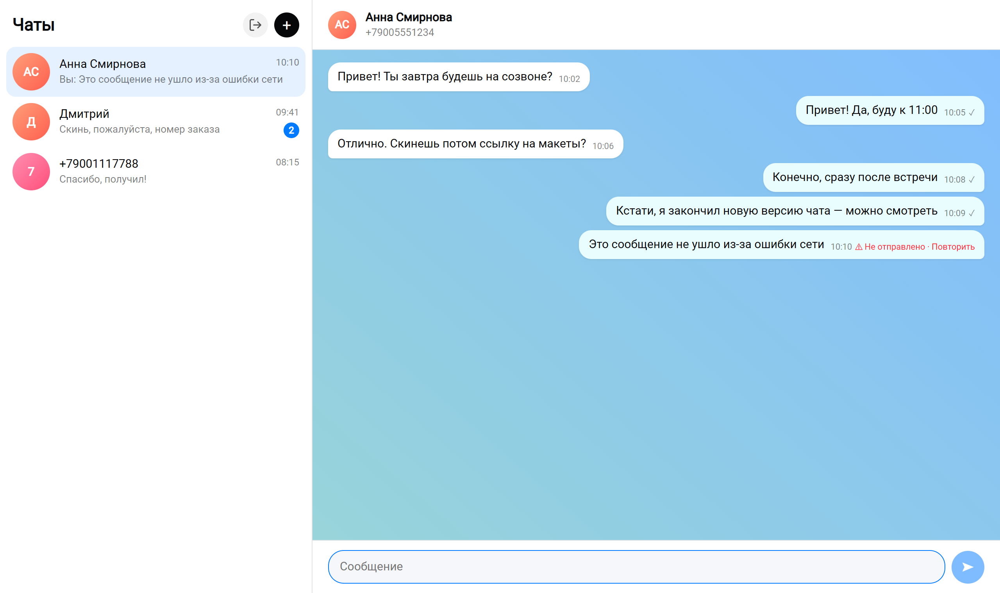
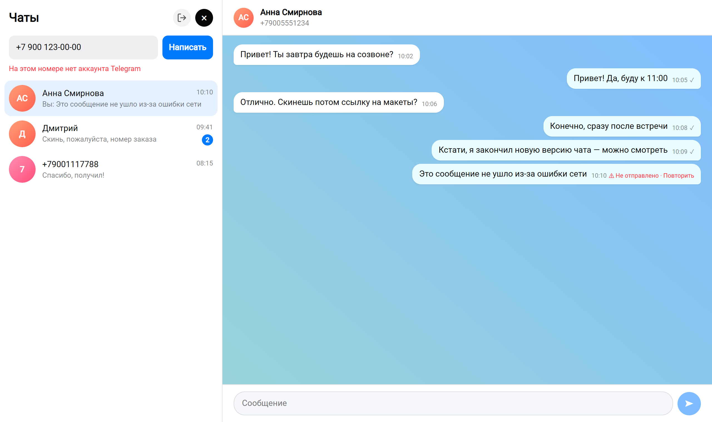
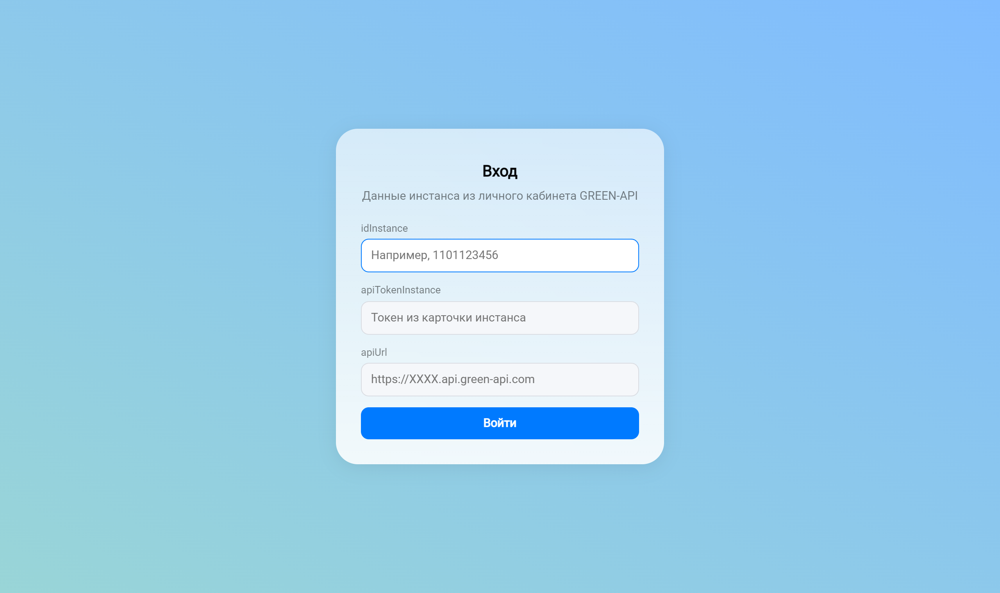
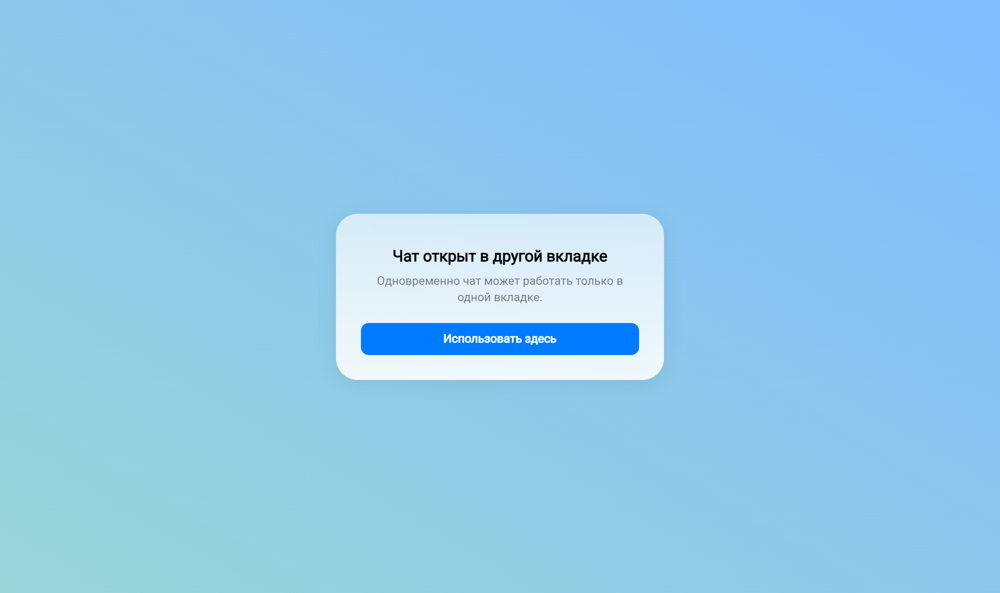
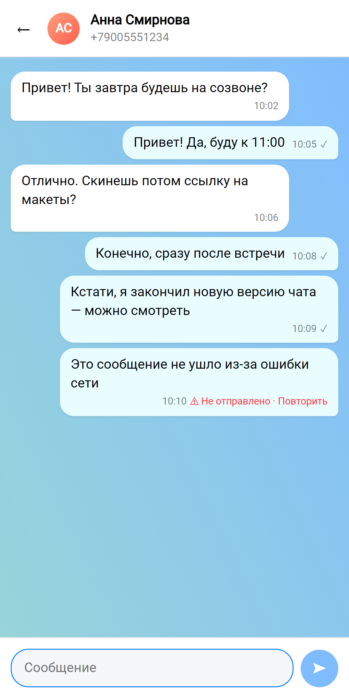

# Telegram-чат на GREEN-API

Тестовое задание на должность «Фронтенд разработчик React».

**Демо:** https://green-api-test-assignment.vercel.app/
Веб-интерфейс для отправки и получения текстовых сообщений в Telegram через [GREEN-API](https://green-api.com/telegram/docs/). Внешний вид — по образцу [web.max.ru](https://web.max.ru/): палитра, шрифт, скругления и градиентный фон чата взяты из дизайн-токенов светлой темы MAX.

## Возможности

- Вход по `idInstance`, `apiTokenInstance` и `apiUrl` с проверкой, что инстанс авторизован
- Создание чата по номеру телефона получателя
- Отправка текстовых сообщений — [SendMessage](https://green-api.com/telegram/docs/api/sending/SendMessage/)
- Получение ответов — [HTTP API](https://green-api.com/telegram/docs/api/receiving/technology-http-api/) (`ReceiveNotification` + `DeleteNotification`)
- Статусы отправки (отправляется / отправлено / ошибка) и повторная отправка неотправленного сообщения
- Счётчик непрочитанных, сохранение переписки между перезагрузками, адаптивная вёрстка

## Скриншоты

На скриншотах — демонстрационные данные. Все файлы — в [`docs/screenshots`](docs/screenshots).

| Переписка | Нет Telegram на номере |
|---|---|
|  |  |

| Вход | Вторая вкладка | Мобильная версия |
|---|---|---|
|  |  |  |

## Запуск

Нужен Node.js 22.12+.

```bash
npm install
npm run dev
```

Откройте http://localhost:5173 и введите данные инстанса из [личного кабинета GREEN-API](https://console.green-api.com/):

| Поле | Где взять |
|---|---|
| `idInstance` | карточка инстанса |
| `apiTokenInstance` | карточка инстанса |
| `apiUrl` | карточка инстанса (по умолчанию подставлен `https://api.green-api.com`) |

К инстансу должен быть привязан аккаунт Telegram, а в настройках инстанса включено получение входящих уведомлений.

| Команда | Что делает |
|---|---|
| `npm run build` | production-сборка в `dist/` |
| `npm test` | тесты (Vitest + Testing Library) |
| `npm run lint` | линтер (oxlint) |

Линтер, тесты и сборка запускаются в GitHub Actions на каждый push.

## Как устроено

Архитектура — [Feature-Sliced Design](https://feature-sliced.design/). Импорты идут только вниз по слоям (`pages → widgets → features → entities → shared`), в модули заходим только через их `index.ts`.

```
src/
├── app/                   — корень приложения: вход, защита от второй вкладки, глобальные стили
├── pages/
│   └── messenger/         — страница мессенджера: собирает виджеты, держит активный чат
├── widgets/
│   ├── chat-sidebar/      — список чатов и создание нового
│   └── chat-window/       — переписка и поле ввода
├── features/
│   ├── auth/              — форма входа, хранение учётных данных
│   ├── create-chat/       — номер телефона → CheckAccount → новый чат
│   ├── send-message/      — оптимистичная отправка, повтор, поле ввода
│   ├── receive-messages/  — получение входящих (long polling)
│   └── single-tab/        — только одна активная вкладка (Web Locks API)
├── entities/
│   └── chat/              — модель чатов (типы, редьюсер, стор на zustand) и их UI
└── shared/
    ├── api/green-api/     — типизированный клиент GREEN-API
    ├── lib/               — нормализация телефона, текст ошибок, форматирование времени, cn()
    ├── ui/                — общие компоненты: Button, IconButton, Input, Field, ErrorText, Card
    └── styles/            — SCSS-миксины (брейкпоинт, обрезка текста, системная плашка)
```

Тесты лежат рядом с кодом (`*.test.ts(x)`) и покрывают логику, где ошибка стоит дороже всего: редьюсер и стор чатов (сохранение и восстановление переписки), клиент API, цикл получения уведомлений (удаление из очереди даже при ошибке обработчика, остановка опроса при выходе) и поведение поля ввода.

### Решения

- **Поле `apiUrl`.** В ТЗ для входа названы `idInstance` и `apiTokenInstance`, но по [документации](https://green-api.com/telegram/docs/before-start/) запросы идут на `{{apiUrl}}/waInstance{{idInstance}}/...`, а `apiUrl` у каждого инстанса свой и выдаётся в личном кабинете вместе с ними. Поэтому это обычное поле формы с общим хостом по умолчанию.
- **Номер телефона → chatId.** В Telegram входящие уведомления приходят с числовым `chatId`, а не с номером телефона. Поэтому при создании чата номер проверяется через [CheckAccount](https://green-api.com/telegram/docs/api/service/CheckAccount/): так сразу видно, есть ли у номера Telegram, и ответы потом попадают в правильный чат.
- **Получение сообщений.** `ReceiveNotification` вызывается с `receiveTimeout=20` — сервер держит запрос, пока не придёт уведомление, так что нет лишних запросов раз в секунду. После обработки уведомление удаляется через `DeleteNotification`, иначе очередь не продвинется. Неподходящие уведомления (статусы, не текстовые сообщения) тоже удаляются. При сетевой ошибке — повтор через 3 секунды и баннер «Переподключаемся». Цикл отменяется через `AbortController` при выходе.
- **Одна активная вкладка.** Все вкладки браузера делят одну очередь уведомлений инстанса: если бы опрашивали все, сообщения «разбегались» бы по вкладкам, а переписка в `localStorage` перезаписывалась. Поэтому, как в WhatsApp Web, работает только одна вкладка — остальные показывают «Чат открыт в другой вкладке» с кнопкой «Использовать здесь». Реализовано на [Web Locks API](https://developer.mozilla.org/docs/Web/API/Web_Locks_API) (`useSingleTab`): активная вкладка держит замок, остальные ждут в очереди и включаются сами, когда её закроют; кнопка забирает замок через `steal`.
- **Дубли.** Сообщения дедуплицируются по `idMessage` — на случай, если уведомление пришло повторно.
- **Входящее от нового собеседника** автоматически создаёт чат с его именем.
- **Отправка** оптимистичная: сообщение появляется сразу со статусом «отправляется», затем получает `idMessage` или помечается ошибкой.
- **Хранение.** Учётные данные — в `sessionStorage` (живут до закрытия вкладки), переписка — в `localStorage` отдельно для каждого инстанса (middleware `persist` из zustand).
- **Состояние.** Чаты — сущность `entities/chat`, стор на [zustand](https://zustand.docs.pmnd.rs/). Логика изменений — чистый `chatsReducer` (покрыт тестами), стор только вызывает его. Компоненты читают стор через селекторы (`useChats((s) => s.chats)`), поэтому перерисовываются, только когда меняется нужная им часть: например, фичи, которым нужен лишь `dispatch`, не перерисовываются от новых сообщений. Стор создаётся в `ChatsProvider` на каждый инстанс (паттерн zustand «стор + контекст»), а не глобально — так у инстансов своя переписка, а в тестах всегда чистый стор.
- **Стили.** SCSS-модули лежат рядом с компонентом (`Button.tsx` + `Button.module.scss`), поэтому классы не пересекаются между слоями. Глобальное — только тема (CSS-переменные) и сброс стилей в `app/styles`. Общие кнопки и поля вынесены в `shared/ui`, повторяющиеся куски стилей — в миксины `shared/styles`.
- **Минимум зависимостей.** В рантайме только React и zustand (~1 КБ), Sass нужен только при сборке — как требовал пункт «максимально простой интерфейс».

## Стек

React 19, TypeScript, zustand, SCSS Modules, Vite, Vitest, Testing Library, oxlint.
